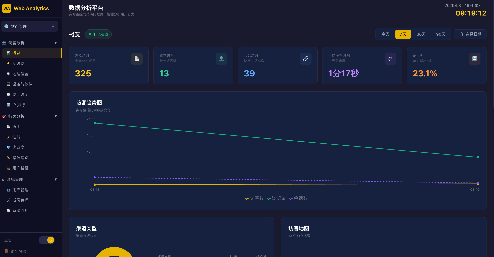
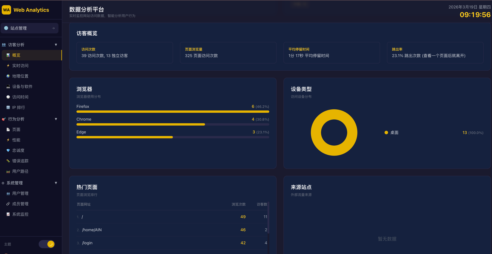
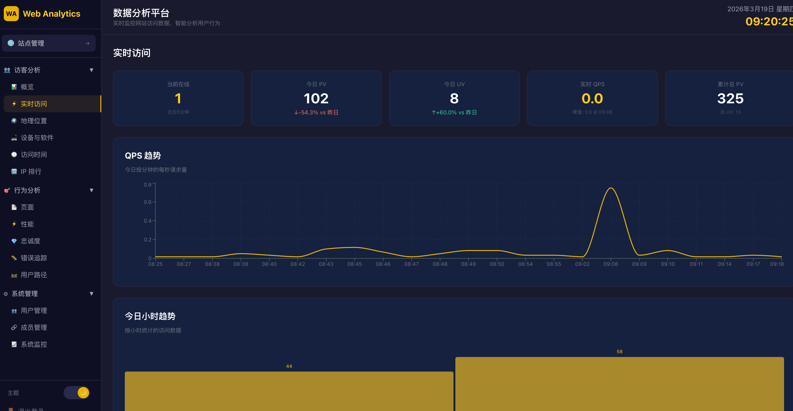
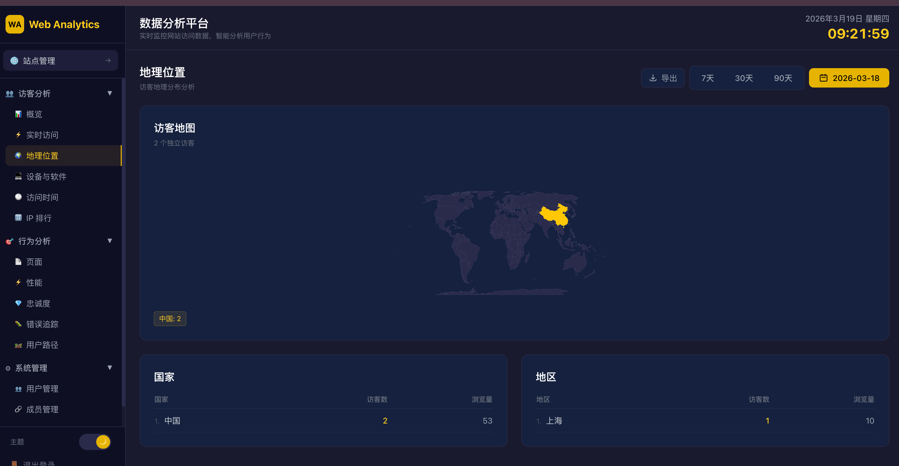
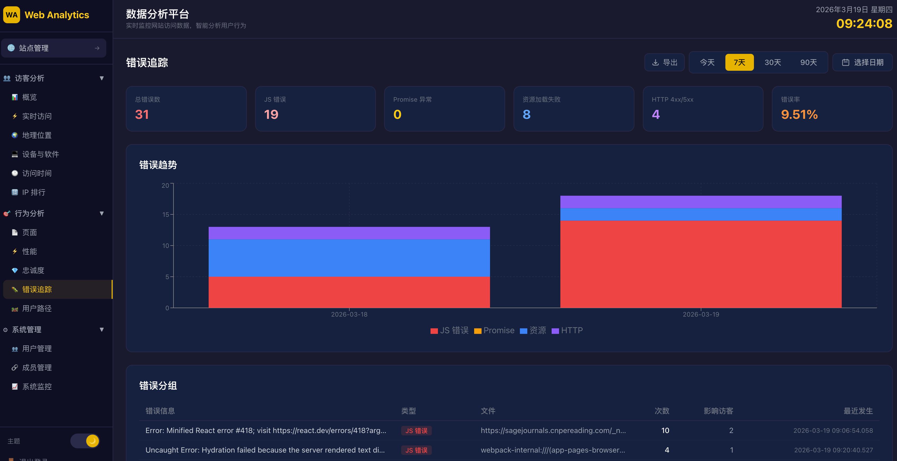
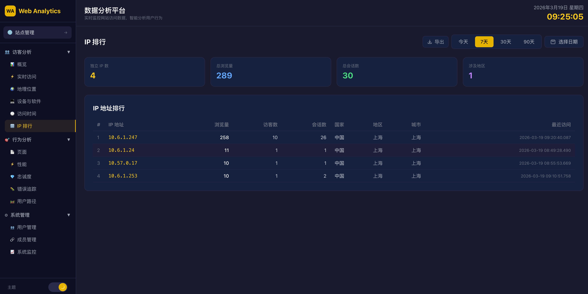

<p align="center">
  
</p>

<h3 align="center">WebAnalytics —— 轻量级、隐私友好的开源网站分析平台</h3>

<p align="center">
  
  
  
  
  
</p>

---

## 💎 WebAnalytics 是什么？

**🎯 隐私优先的网站分析平台，让数据洞察更简单**

WebAnalytics 是一个功能完整的**开源网站分析平台**，采用 Go + React 前后端分离架构，以 ClickHouse 为分析引擎。**无需 Cookie**，通过隐私友好的方式追踪网站访问数据，提供实时仪表盘、多维度数据分析、完整的 RBAC 权限管理，是 Google Analytics / Plausible 的自托管替代方案。

**🔒 隐私优先，无需 Cookie 同意弹窗**

基于 UA + 屏幕分辨率 + 日期的哈希生成每日轮换访客 ID，不使用 Cookie、不采集个人信息，完全符合 GDPR / CCPA 等隐私法规要求。

---

## 🌟 核心亮点

### 📡 轻量数据采集

- 追踪 SDK 仅约 3KB，支持 `sendBeacon` + XHR 双通道
- 自动适配 SPA（React / Vue / Angular），监听 `pushState` / `popstate`
- 集成 Navigation Timing API，自动采集页面性能各阶段耗时
- 内置 UTM 参数解析、自定义事件、页面停留时长追踪

### ⚡ 高性能分析引擎

- ClickHouse 列式存储 + 物化视图预聚合，毫秒级查询响应
- 内存事件缓冲区，批量写入 ClickHouse（5 秒 / 5000 条自动刷新）
- 数据按月分区，自动 TTL 过期（默认 2 年）

### 🔐 完整权限控制

- 全局角色 (`admin` / `user`) + 站点角色 (`owner` / `viewer`) 双层 RBAC
- 管理员管理用户、站点、成员分配；普通用户只能查看被分配站点
- 公开注册关闭，仅管理员可创建账号

### 🌍 多维度数据分析

- 实时在线访客、QPS 趋势、时序折线图
- 地理分布（交互式世界地图）、流量来源、设备与浏览器统计
- 页面排行、性能分析、忠诚度分析（新/回访用户对比）

---

## 🚀 功能特性

### 📊 数据分析

| 功能模块 | 描述 |
|:---------|:-----|
| 📈 概览面板 | PV、UV、会话数、跳出率、平均停留时长等核心 KPI |
| ⚡ 实时监控 | 当前在线访客数、实时页面浏览、QPS 趋势 |
| 📉 访客趋势 | 按小时/天粒度的时序折线图，日期范围全局持久化 |
| 🌐 流量来源 | 渠道分布（直接、搜索、社交、引荐等） |
| 🗺️ 地理分布 | 交互式世界地图 + 国家/地区排行表 |
| 💻 设备与软件 | 浏览器、操作系统、设备类型、屏幕分辨率统计 |
| 📄 页面分析 | Top 页面排行，浏览量、唯一访客、跳出率、停留时间 |
| 🔗 来源站点 | 外部引荐流量明细 |
| 🕐 访问时间 | 按小时的访客热力分布 |
| 🚀 性能分析 | 页面加载各阶段耗时趋势图、按 URL 性能排行 |
| 💎 忠诚度 | 新/回访用户对比，访问频次分布，停留时长分布 |

### 📡 数据采集

| 功能模块 | 描述 |
|:---------|:-----|
| 🍪 无 Cookie 追踪 | 基于哈希的每日轮换访客 ID，无需 Cookie 同意弹窗 |
| 📦 轻量 SDK | 约 3KB，支持 `sendBeacon` + XHR 双通道 |
| 🔄 SPA 支持 | 自动监听 `pushState` / `popstate`，适配主流前端框架 |
| ⏱️ 性能采集 | 集成 Navigation Timing API，采集网络/服务器/DOM 各阶段耗时 |
| ⏳ 停留时长 | 基于 `visibilitychange` 事件精确追踪 |
| 🏷️ UTM 参数 | 自动解析 `utm_source`、`utm_medium`、`utm_campaign` 等 |
| 🎯 自定义事件 | 通过 `window.wa.track(name, value, props)` 追踪业务事件 |
| 🌍 GeoIP 定位 | 可选集成 MaxMind GeoLite2，精确到国家/地区/城市 |

### 🔐 权限管理

| 功能模块 | 描述 |
|:---------|:-----|
| 👥 用户管理 | 用户增删改查、密码重置、角色分配 |
| 🏠 站点管理 | 多站点创建/删除、域名配置、追踪 ID 自动生成 |
| 👤 成员管理 | 站点成员分配、批量操作、角色控制 |
| 🛡️ 权限矩阵 | 全局角色 + 站点角色双层 RBAC 精细控制 |

### 📜 项目演示图
  <table>
    <tr>
      <td></td>
      <td></td>
    </tr>
    <tr>
      <td></td>
      <td></td>
    </tr>
    <tr>
      <td></td>
      <td></td>
    </tr>
  </table>
---

## 🛠️ 技术栈

### 后端

| 技术 | 版本 | 描述 |
|:-----|:-----|:-----|
| `Go` | 1.25+ | 后端开发语言 |
| `Chi` | 5.2+ | 轻量高性能 HTTP 路由 |
| `ClickHouse` | 24.1+ | 列式分析数据库（事件存储） |
| `SQLite` | — | 嵌入式元数据库（用户/站点/成员） |
| `JWT` | 5.3+ | 无状态认证 |
| `bcrypt` | — | 密码安全加密 |
| `GeoIP2` | 1.13+ | MaxMind IP 地理定位 |

### 前端

| 技术 | 版本 | 描述 |
|:-----|:-----|:-----|
| `React` | 18.3+ | UI 框架 |
| `TypeScript` | 5.7+ | 类型安全的 JavaScript |
| `Vite` | 5.4+ | 下一代前端构建工具 |
| `Tailwind CSS` | 3.4+ | 原子化 CSS 框架 |
| `Recharts` | 2.15+ | React 图表库 |
| `TanStack Query` | 5.62+ | 异步状态管理 |
| `React Router` | 6.28+ | SPA 路由 |
| `react-simple-maps` | 3.0+ | 交互式地图 |

---

## 📦 快速开始

### 环境要求

- Go 1.25+
- Node.js 18+
- ClickHouse 24.1+
- (可选) MaxMind GeoLite2-City.mmdb

### 1. 克隆项目

```bash
git clone https://github.com/ydcloud-dy/webanalytics.git
cd webanalytics
```

### 2. 启动服务

**方式一：Docker Compose（推荐）**

```bash
# 编辑配置 (可选)
cp deploy/docker/.env.example .env
vim .env

# 一键启动
docker compose up -d

# 访问系统
# http://localhost:8080
```

**方式二：本地编译**

```bash
# 确保 ClickHouse 已启动
clickhouse-client -q "CREATE DATABASE IF NOT EXISTS webanalytics"

# 编译前端 + 后端
make build

# 启动
./bin/webanalytics
```

**方式三：分步编译**

```bash
# 编译前端
cd web && npm ci && npx vite build && cd ..

# 编译后端
CGO_ENABLED=0 go build -o bin/webanalytics ./cmd/server/

# 启动
./bin/webanalytics
```

### 3. 默认账号

| 用户名 | 密码 |
|:-------|:-----|
| `admin@webanalytics.local` | `admin123` |

> ⚠️ **重要**: 生产环境请立即修改默认密码！

---

## 🚢 部署方式

我们提供多种部署方式，请根据实际环境选择：

| 部署方式 | 适用场景 | 复杂度 |
|:---------|:---------|:-------|
| Docker Compose | 快速体验、开发测试、生产部署 | ⭐ 简单 |
| 源码编译 | 开发调试、二次开发 | ⭐⭐ 中等 |

---

## 📡 SDK 接入

### 基本接入

在被追踪网站的 `<head>` 或 `<body>` 中添加一行代码即可：

```html
<script defer data-site-id="YOUR_TRACKING_ID" src="https://your-domain.com/sdk/tracker.js"></script>
```

`YOUR_TRACKING_ID` 是站点创建后自动生成的追踪 ID（格式：`wa_xxxx`）。

### 自定义事件

```javascript
// 追踪按钮点击
window.wa.track('button_click', 1, { button: 'signup' })

// 追踪购买事件
window.wa.track('purchase', 99.9, { product: 'Pro Plan' })
```

### 手动追踪页面

```javascript
// SPA 场景下手动触发页面追踪
window.wa.pageview()
```

---

## ⚙️ 配置说明

配置文件：`config/config.yaml`，环境变量优先级高于配置文件。

```yaml
server:
  port: "7777"              # 监听端口
  cors_allow_all: true      # CORS 全部放行

database:
  clickhouse_dsn: "clickhouse://default:@localhost:9000/webanalytics"
  sqlite_path: "data/webanalytics.db"

auth:
  jwt_secret: "change-me-in-production"

tracking:
  buffer_size: 5000           # 事件缓冲区大小
  flush_interval_sec: 5       # 缓冲区刷新间隔 (秒)
  geoip_path: ""              # GeoLite2-City.mmdb 路径 (留空禁用)

timezone: "Asia/Shanghai"
```

### 环境变量

| 变量 | 描述 | 默认值 |
|:-----|:-----|:-------|
| `PORT` | 监听端口 | `7777` |
| `CLICKHOUSE_DSN` | ClickHouse 连接串 | `clickhouse://default:@localhost:9000/webanalytics` |
| `SQLITE_PATH` | SQLite 文件路径 | `data/webanalytics.db` |
| `JWT_SECRET` | JWT 签名密钥 | `change-me-in-production` |
| `GEOIP_PATH` | GeoIP 数据库路径 | (空，禁用) |
| `TZ` | 时区 | `Asia/Shanghai` |

---

## 🏗️ 系统架构

```
┌──────────────────┐
│    用户浏览器      │
│                  │
│  tracker.js ─────┼──────▶ POST /api/collect
│                  │              │
│  React SPA ──────┼──────▶ /api/dashboard/*     ┌──────────────┐
│                  │        /api/auth/*      ◀───│   SQLite     │
│                  │        /api/admin/*          │ (用户/站点)   │
└──────────────────┘        /api/sites/*          └──────────────┘
                                │
                          ┌─────▼─────┐
                          │  Buffer   │
                          │ (内存缓冲) │
                          └─────┬─────┘
                                │ 批量写入 (5s/5000条)
                          ┌─────▼─────────────┐
                          │    ClickHouse      │
                          │  (事件 + 物化视图)   │
                          └───────────────────┘
```

**数据流：**
1. 追踪 SDK 向 `/api/collect` 发送事件（pageview / event / leave / performance）
2. 服务端解析 UA、查询 GeoIP、提取 UTM 参数
3. 事件进入内存缓冲区，定时批量写入 ClickHouse
4. 仪表盘通过 React Query 请求 `/api/dashboard/*` 接口
5. 后端查询 ClickHouse 物化视图返回聚合数据

---

## 🔐 权限矩阵

| 操作 | admin | user (owner) | user (viewer) |
|:-----|:-----:|:------------:|:-------------:|
| 创建/删除站点 | ✅ | — | — |
| 修改站点设置 | ✅ | ✅ | — |
| 查看站点数据 | ✅ | ✅ | ✅ |
| 管理站点成员 | ✅ | — | — |
| 管理用户 | ✅ | — | — |

---

## 📖 API 文档

### 认证

所有 `/api/*` 接口（除 `/api/collect`、`/api/auth/login`）需要 Bearer Token：

```
Authorization: Bearer <jwt_token>
```

### 接口总览

#### 🔑 认证接口

| 方法 | 路径 | 描述 |
|:-----|:-----|:-----|
| `POST` | `/api/auth/login` | 登录，返回 JWT Token |
| `GET` | `/api/auth/me` | 获取当前用户信息 |
| `POST` | `/api/auth/refresh` | 刷新 Token |

#### 🏠 站点管理

| 方法 | 路径 | 描述 | 权限 |
|:-----|:-----|:-----|:-----|
| `GET` | `/api/sites` | 站点列表 | admin 全部, user 已分配 |
| `POST` | `/api/sites` | 创建站点 | admin |
| `GET` | `/api/sites/{siteId}` | 获取站点详情 | 已分配成员 |
| `PUT` | `/api/sites/{siteId}` | 更新站点 | admin / owner |
| `DELETE` | `/api/sites/{siteId}` | 删除站点 | admin |

#### 📊 数据分析（支持 `from` / `to` 查询参数，格式 `YYYY-MM-DD`）

| 方法 | 路径 | 描述 |
|:-----|:-----|:-----|
| `GET` | `/api/dashboard/{siteId}/overview` | 核心指标概览 |
| `GET` | `/api/dashboard/{siteId}/timeseries` | 时序数据 |
| `GET` | `/api/dashboard/{siteId}/channels` | 流量渠道分布 |
| `GET` | `/api/dashboard/{siteId}/browsers` | 浏览器统计 |
| `GET` | `/api/dashboard/{siteId}/devices` | 设备类型统计 |
| `GET` | `/api/dashboard/{siteId}/os` | 操作系统统计 |
| `GET` | `/api/dashboard/{siteId}/geo` | 地理位置分布 |
| `GET` | `/api/dashboard/{siteId}/pages` | Top 页面 |
| `GET` | `/api/dashboard/{siteId}/pages-ext` | 扩展页面数据 |
| `GET` | `/api/dashboard/{siteId}/referrers` | 来源站点 |
| `GET` | `/api/dashboard/{siteId}/screen-resolutions` | 屏幕分辨率 |
| `GET` | `/api/dashboard/{siteId}/hourly-visitors` | 每小时访客数 |
| `GET` | `/api/dashboard/{siteId}/realtime` | 实时在线人数 |
| `GET` | `/api/dashboard/{siteId}/loyalty` | 忠诚度数据 |
| `GET` | `/api/dashboard/{siteId}/performance-overview` | 性能概览 |
| `GET` | `/api/dashboard/{siteId}/performance-timeseries` | 性能趋势 |
| `GET` | `/api/dashboard/{siteId}/page-performance` | 按页面性能 |

#### 🛡️ 管理接口（仅 admin）

| 方法 | 路径 | 描述 |
|:-----|:-----|:-----|
| `GET` | `/api/admin/users` | 用户列表 |
| `POST` | `/api/admin/users` | 创建用户 |
| `PUT` | `/api/admin/users/{userId}` | 编辑用户 |
| `DELETE` | `/api/admin/users/{userId}` | 删除用户 |
| `PUT` | `/api/admin/users/{userId}/password` | 重置密码 |
| `GET` | `/api/admin/sites/{siteId}/members` | 站点成员列表 |
| `POST` | `/api/admin/sites/{siteId}/members` | 添加站点成员 |
| `DELETE` | `/api/admin/sites/{siteId}/members/{userId}` | 移除站点成员 |

#### 📡 数据采集

| 方法 | 路径 | 描述 |
|:-----|:-----|:-----|
| `POST` | `/api/collect` | 接收追踪事件（限流 100 次/分钟） |
| `GET` | `/api/collect` | 1x1 像素追踪回退 |
| `GET` | `/sdk/tracker.js` | 追踪 SDK（缓存 1 小时） |
| `GET` | `/api/health` | 健康检查 |

---

## 🗄️ 数据库设计

### ClickHouse — 事件表

```sql
CREATE TABLE events (
    site_id       UInt32,
    event_type    String,       -- pageview | event | leave | performance
    timestamp     DateTime64(3, 'Asia/Shanghai'),
    session_id    String,
    visitor_id    String,
    pathname      String,
    hostname      String,
    referrer      String,
    referrer_source String,     -- direct | organic | social | referral
    utm_source    String,
    utm_medium    String,
    utm_campaign  String,
    browser       String,
    os            String,
    device_type   String,       -- desktop | mobile | tablet | bot
    country       String,
    duration      Float64,
    -- 性能字段
    network_time    Float64,
    server_time     Float64,
    dom_processing  Float64,
    page_load_time  Float64
    -- ...
)
ENGINE = MergeTree()
PARTITION BY toYYYYMM(timestamp)
ORDER BY (site_id, event_type, timestamp, visitor_id)
TTL timestamp + INTERVAL 2 YEAR
```

自动创建物化视图：`daily_stats_mv`、`hourly_stats_mv`、`channel_stats_mv`、`geo_stats_mv`。

### SQLite — 元数据表

```sql
-- 用户
CREATE TABLE users (
    id INTEGER PRIMARY KEY AUTOINCREMENT,
    email TEXT UNIQUE NOT NULL,
    password_hash TEXT NOT NULL,
    role TEXT DEFAULT 'user',        -- admin | user
    created_at DATETIME DEFAULT CURRENT_TIMESTAMP
);

-- 站点
CREATE TABLE sites (
    id INTEGER PRIMARY KEY AUTOINCREMENT,
    domain TEXT NOT NULL,
    name TEXT,
    tracking_id TEXT UNIQUE,          -- wa_xxxx
    timezone TEXT DEFAULT 'Asia/Shanghai',
    created_at DATETIME DEFAULT CURRENT_TIMESTAMP
);

-- 站点成员
CREATE TABLE site_members (
    user_id INTEGER REFERENCES users(id),
    site_id INTEGER REFERENCES sites(id),
    role TEXT DEFAULT 'viewer',       -- owner | viewer
    PRIMARY KEY (user_id, site_id)
);
```

---

## 📁 项目结构

```
webanalytics/
├── cmd/server/
│   ├── main.go                 # 程序入口
│   └── static/
│       ├── tracker.js          # 追踪 SDK (运行时)
│       └── dist/               # 前端构建产物
├── internal/
│   ├── auth/                   # 认证服务 (JWT、用户管理)
│   ├── config/                 # 配置加载 (YAML + 环境变量)
│   ├── middleware/             # HTTP 中间件 (CORS、限流)
│   ├── query/                  # 分析查询 (ClickHouse)
│   ├── site/                   # 站点管理 (CRUD、成员)
│   ├── store/                  # 数据层 (ClickHouse、SQLite)
│   └── tracking/               # 事件采集 (解析、缓冲、批量写入)
├── web/                        # React 前端
│   ├── src/
│   │   ├── pages/              # 页面组件
│   │   ├── components/         # 通用 UI 组件
│   │   ├── contexts/           # React Context (认证、主题)
│   │   ├── lib/                # API 客户端
│   │   ├── App.tsx             # 路由配置
│   │   └── main.tsx            # 入口
│   ├── package.json
│   └── tailwind.config.js
├── sdk/
│   └── tracker.js              # 追踪 SDK 源码
├── config/
│   └── config.yaml             # 配置模板
├── deploy/
│   ├── docker/                 # Docker 部署
│   └── bare/                   # 裸机部署
├── docker-compose.yml
├── Dockerfile
├── Makefile
└── go.mod
```

---

## 🌍 GeoIP 配置

如需地理位置功能，需要 MaxMind GeoLite2-City 数据库：

1. 在 [MaxMind](https://www.maxmind.com/) 注册账号
2. 下载 GeoLite2-City.mmdb
3. 配置路径：
   ```yaml
   tracking:
     geoip_path: "/path/to/GeoLite2-City.mmdb"
   ```
   或设置环境变量：
   ```bash
   GEOIP_PATH=/path/to/GeoLite2-City.mmdb
   ```

---

## ⚠️ 生产部署注意事项

| 事项 | 说明 |
|:-----|:-----|
| 🔑 修改 JWT 密钥 | 务必修改 `jwt_secret`，不要使用默认值 |
| 🔒 修改管理员密码 | 首次登录后立即修改 `admin123` 默认密码 |
| 🗃️ ClickHouse 密码 | 生产环境为 ClickHouse 设置认证密码 |
| 🔐 HTTPS | 建议使用 Nginx / Caddy 反向代理并配置 SSL 证书 |
| 💾 备份 | 定期备份 SQLite 数据库文件和 ClickHouse 数据 |
| 🚦 限流 | 事件采集接口默认 100 次/分钟，可根据流量调整 |

---

## 🤝 贡献指南

欢迎提交 Issue 和 Pull Request！

1. Fork 本仓库
2. 创建特性分支 (`git checkout -b feature/AmazingFeature`)
3. 提交更改 (`git commit -m 'Add some AmazingFeature'`)
4. 推送到分支 (`git push origin feature/AmazingFeature`)
5. 提交 Pull Request

---

## 📄 许可证

本项目采用 [MIT License](LICENSE) 开源许可证。

---

## 📞 联系方式

- 📮 Issue: [GitHub Issues](https://github.com/ydcloud-dy/webanalytics/issues)
- 📧 Email: dycloudlove@163.com

---

<p align="center">
  <b>如果觉得项目有帮助，欢迎 Star ⭐ 支持！</b>
</p>
